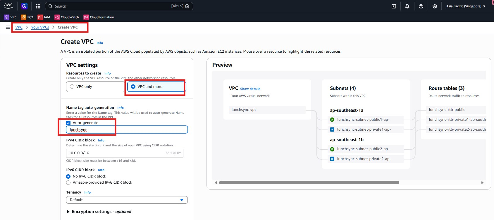
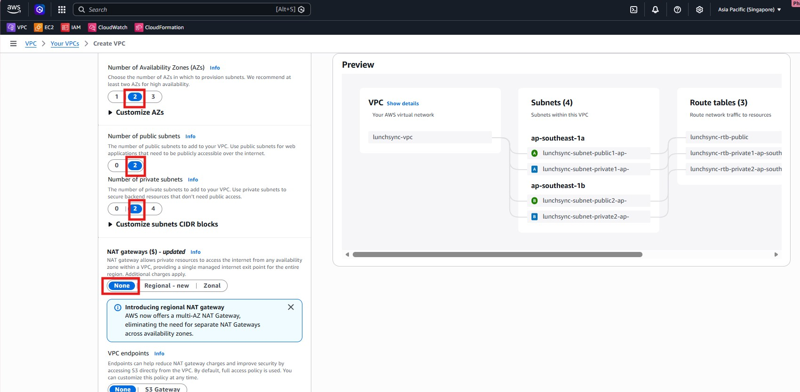
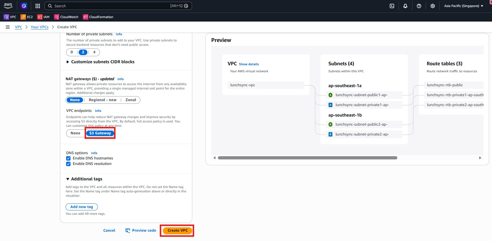
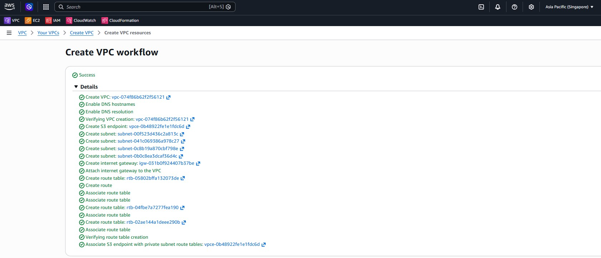

1. Mở **VPC console** và bắt đầu quy trình tạo VPC.

2. Cấu hình các thông số chính của VPC như CIDR block và các tuỳ chọn mạng cơ bản.

3. Rà soát phần cấu hình subnet và route phục vụ môi trường.

4. Tạo VPC và kiểm tra lại các tài nguyên mạng trước khi chuyển sang bước tiếp theo.

