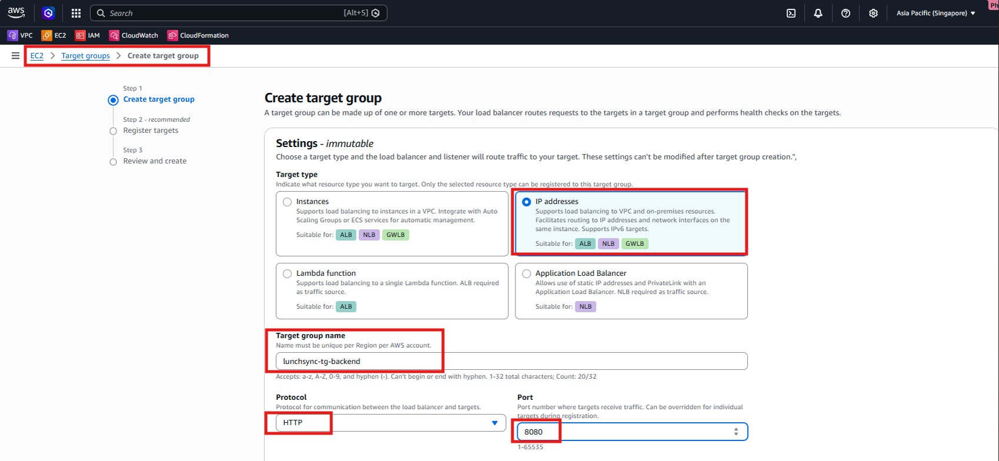
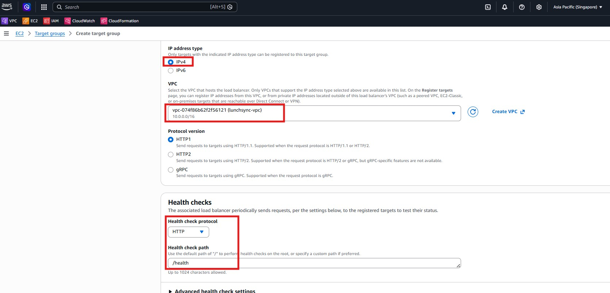
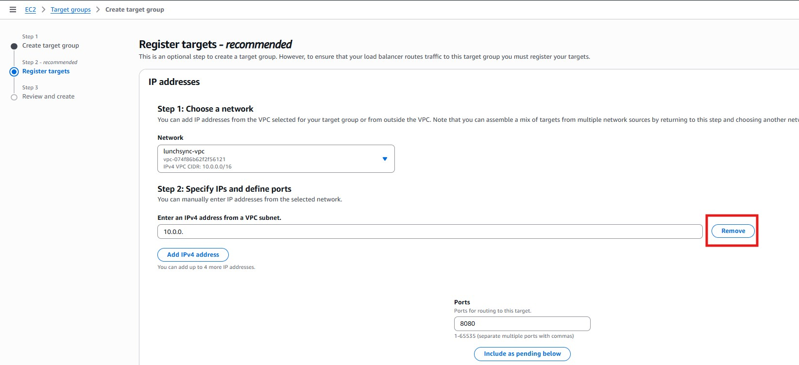
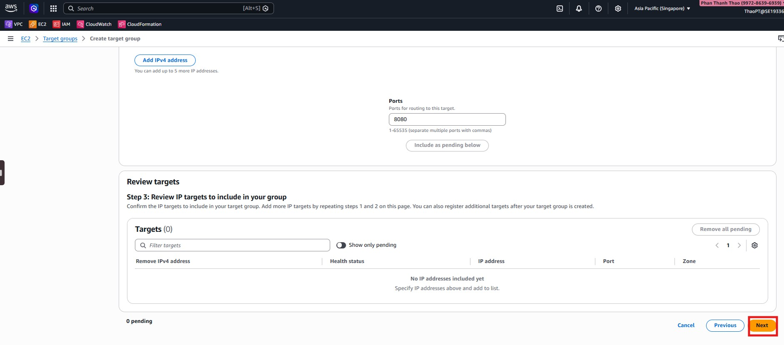
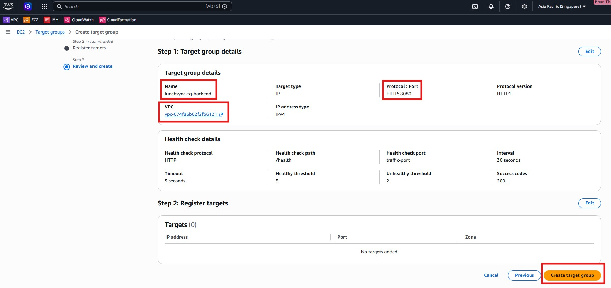
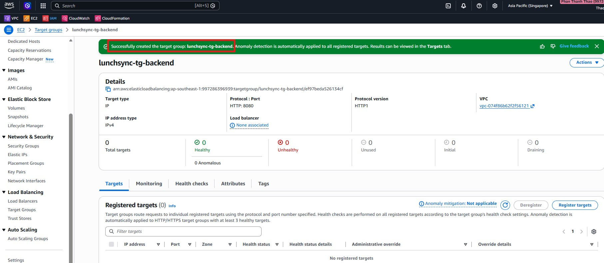

1. Open the **EC2 / Target Groups** area and choose to create a new target group.

2. Select the target type and protocol that match the backend service.

3. Enter the target group name and keep the VPC aligned with the application network.

4. Configure health check settings so the load balancer can verify backend availability.

5. Register the backend instances or targets that should receive traffic.

6. Review the target group configuration and complete the creation flow.

