1. Open the **Load Balancers** area and choose to create an **Application Load Balancer**.

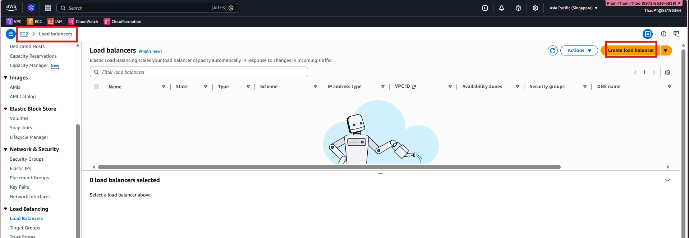

2. Enter the basic load balancer details such as name, scheme, and IP address type.

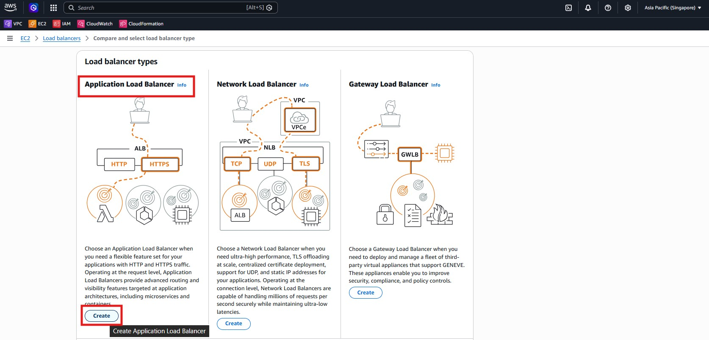

3. Select the VPC and subnets where the ALB should be deployed.

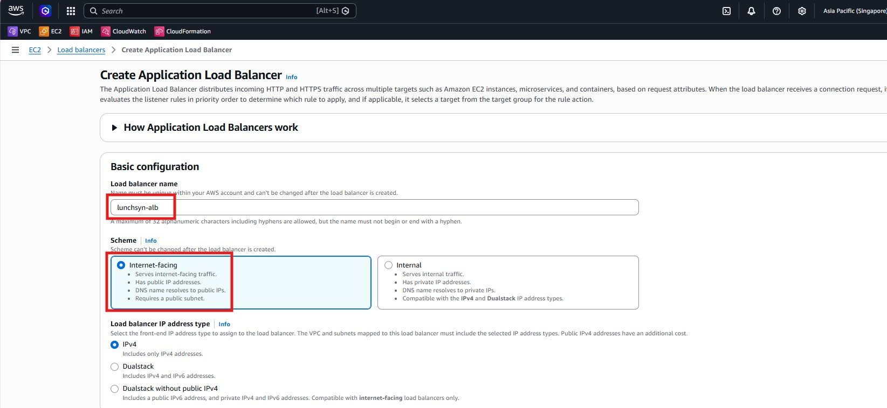

4. Attach the security group that controls inbound traffic to the ALB.

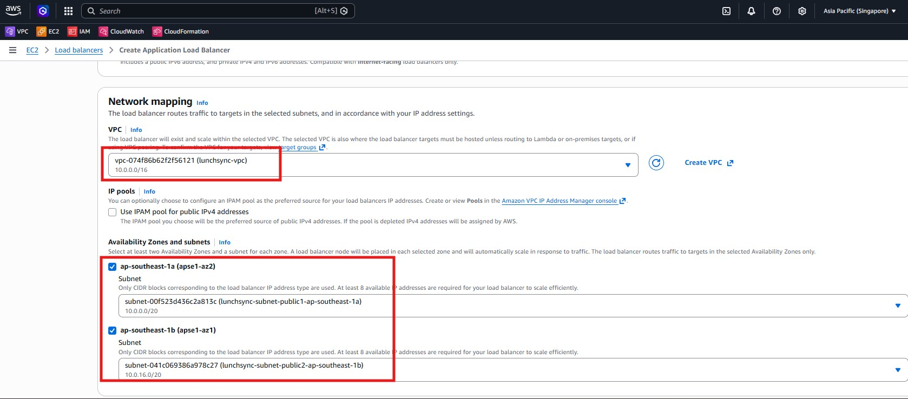

5. Configure listeners and prepare the forwarding rule.

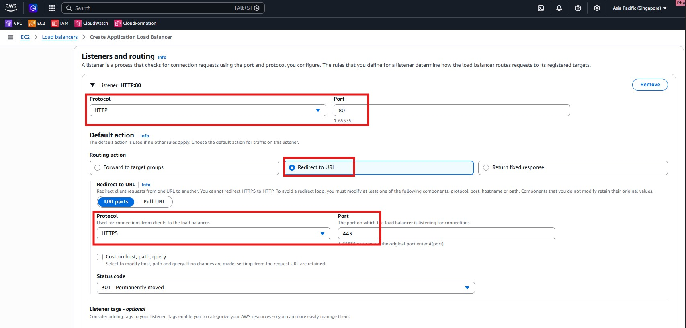

6. Connect the listener to the target group created in the previous section.

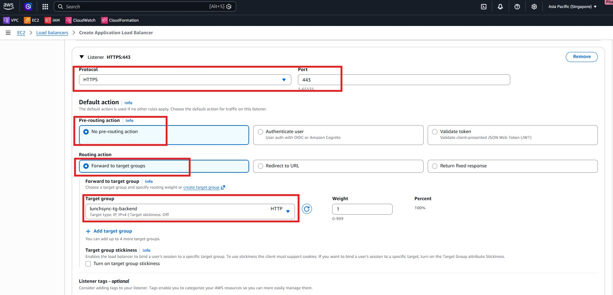

7. Review the summary before creating the load balancer.

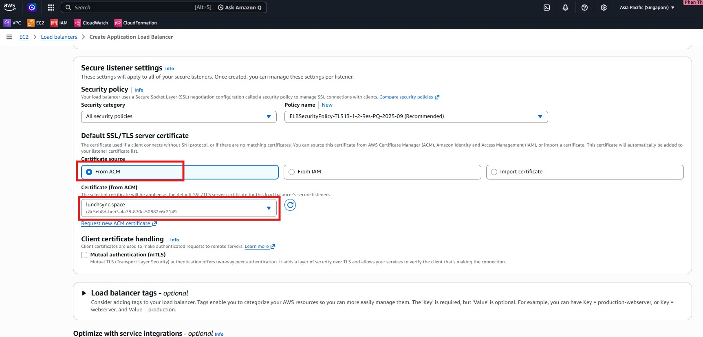

8. Verify the listener and target group association after creation.

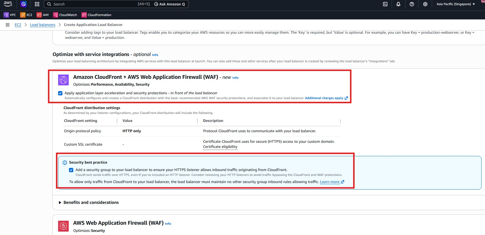

9. Check the load balancer details and DNS name.

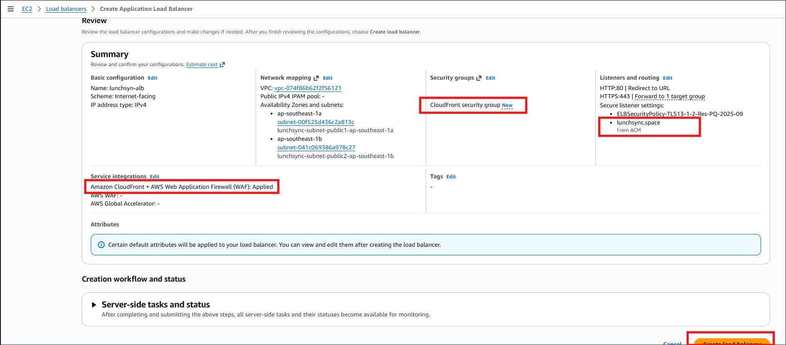

10. Review the health and traffic configuration from the ALB console.

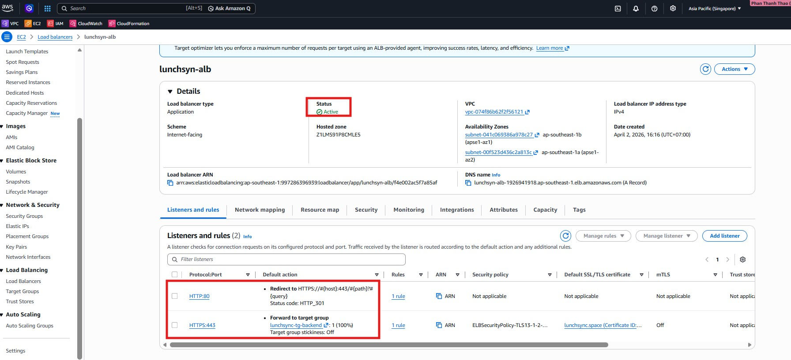

11. Confirm the final setup of the ALB resources.

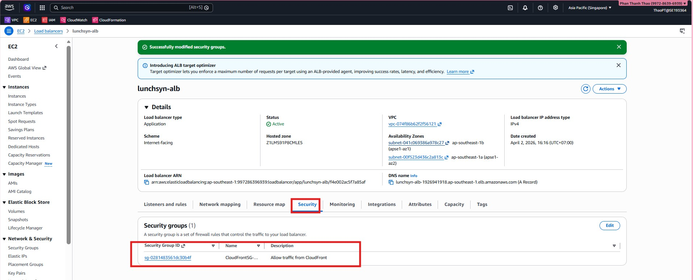

12. Record the completed ALB state for later DNS mapping and testing.

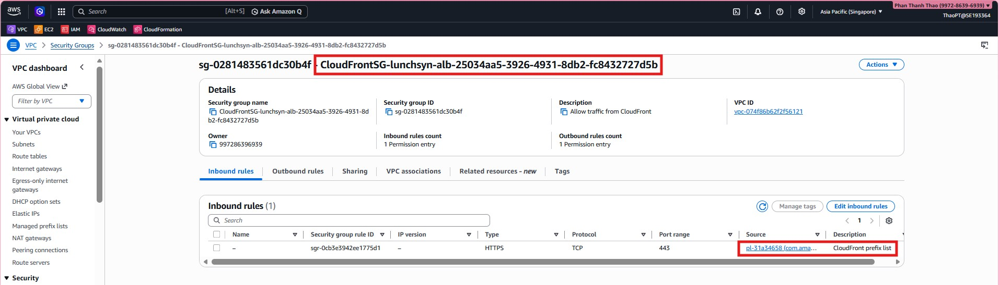
