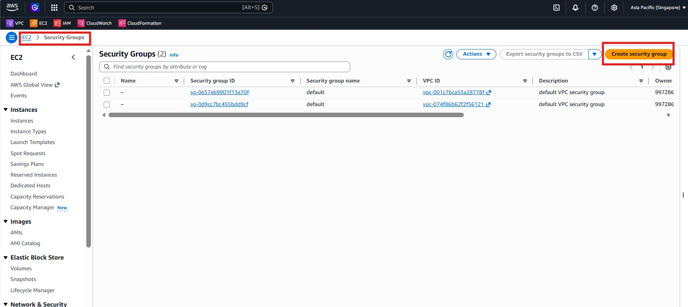
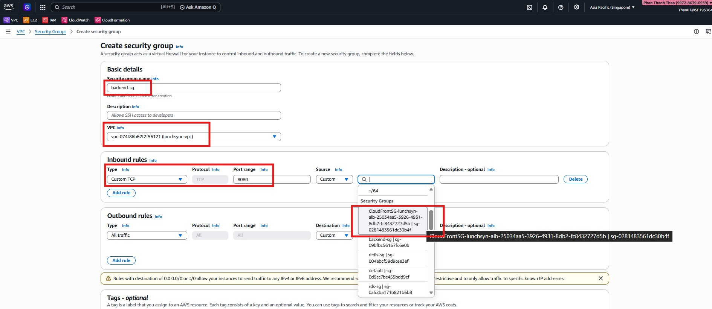
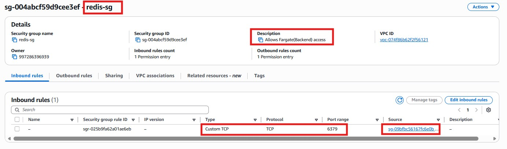
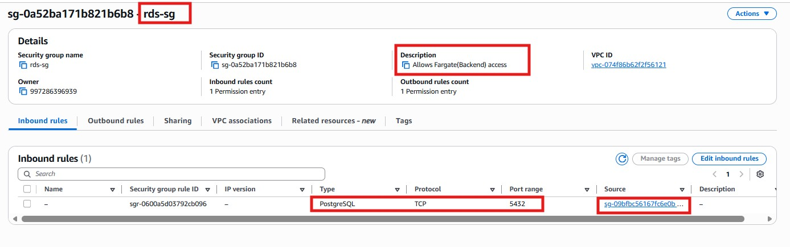

1. Mở phần **Security Groups** và rà soát các group được dùng cho tài nguyên của ứng dụng.

2. Cấu hình inbound rules cho security group phía ALB.

3. Cấu hình security group của backend để chỉ nhận lưu lượng từ ALB hoặc nguồn tin cậy.

4. Rà soát bộ rule cuối cùng và lưu cấu hình security group.

