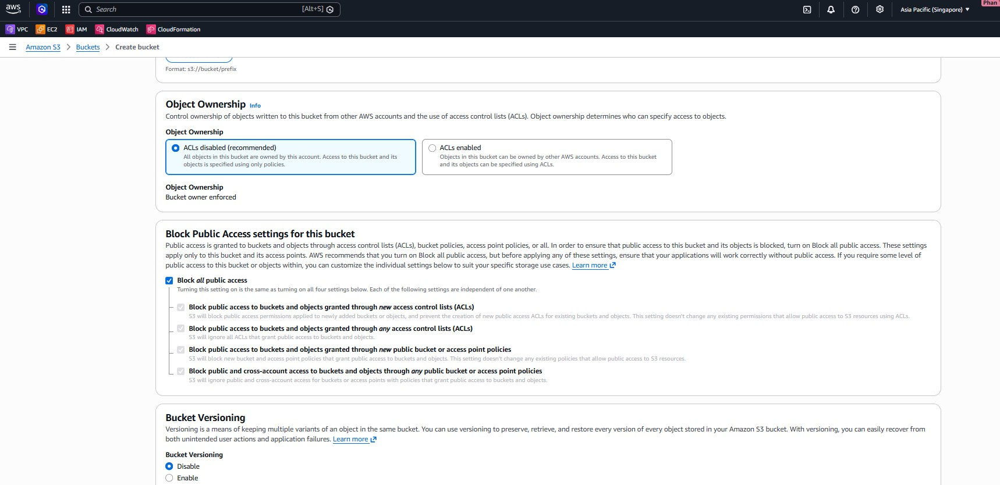

1. Open the **S3 console** and start creating a bucket for the frontend assets.

2. Enter the bucket name and review the regional placement.

3. Configure the bucket options needed for the static site assets.

4. Upload the required frontend files to the bucket.

5. Verify that the objects are stored successfully in the bucket.

