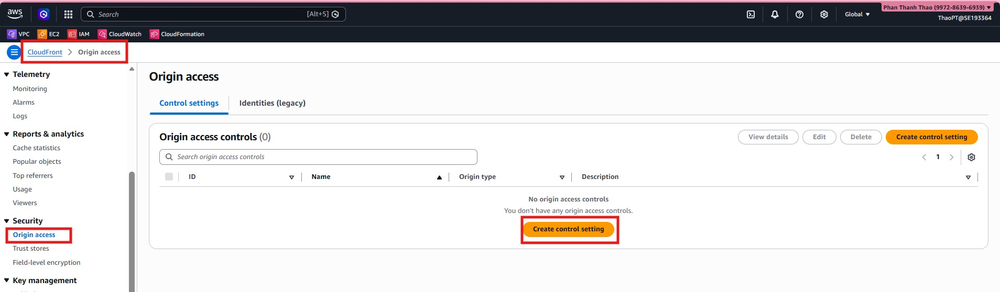
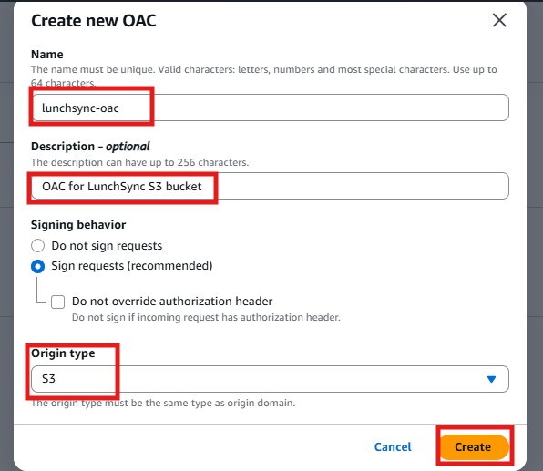
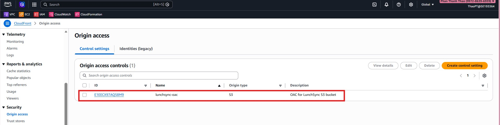

1. Open the **Origin Access Control** configuration in CloudFront.

2. Create an OAC resource for the S3 bucket origin.

3. Review the generated OAC settings and prepare to attach them to the distribution.

