1. Mở **CloudFront console** và bắt đầu tạo distribution mới.

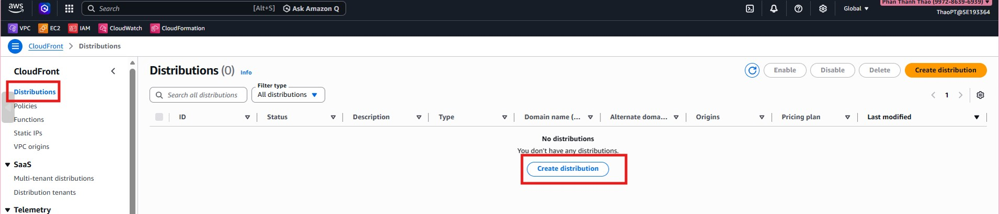

2. Chọn S3 bucket làm origin và kiểm tra các thông tin origin.

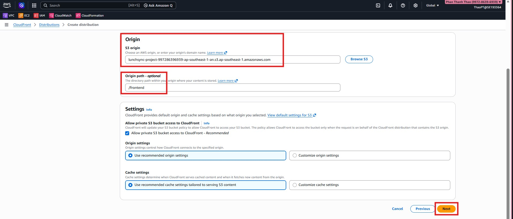

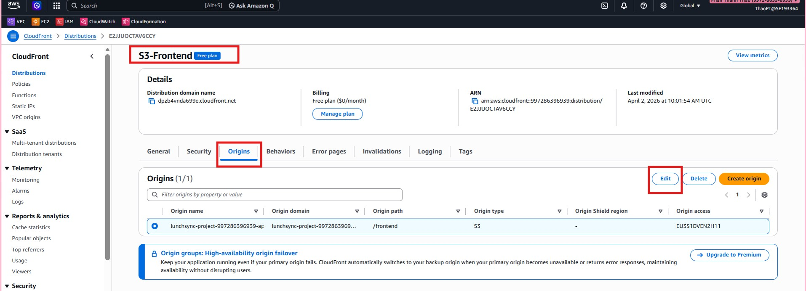

3. Cấu hình viewer settings và cache behavior cho distribution.

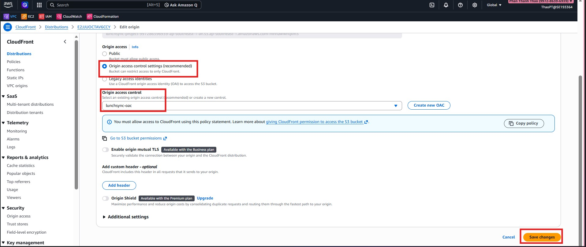

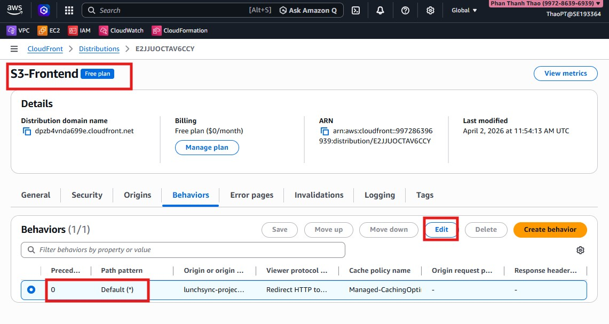

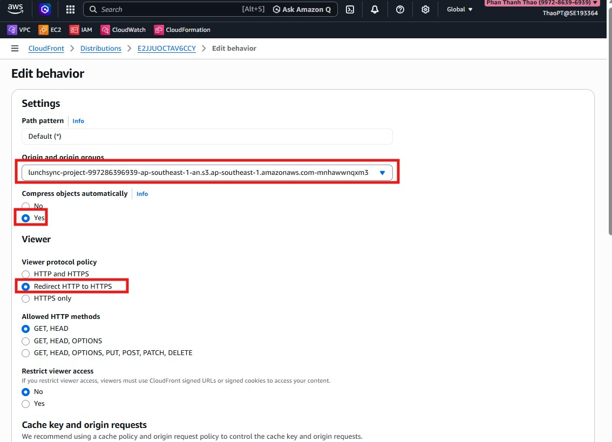

4. Gắn OAC đã tạo trước đó và cập nhật policy truy cập của S3 nếu cần.

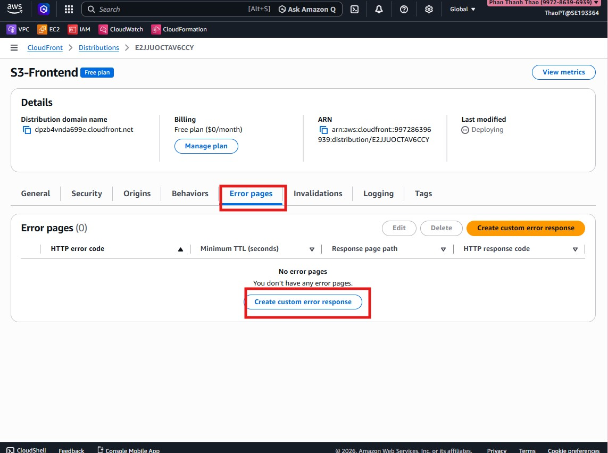

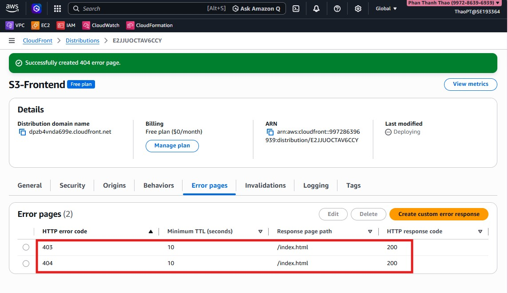

5. Tiếp tục cấu hình các tuỳ chọn như default root object và protocol hỗ trợ.

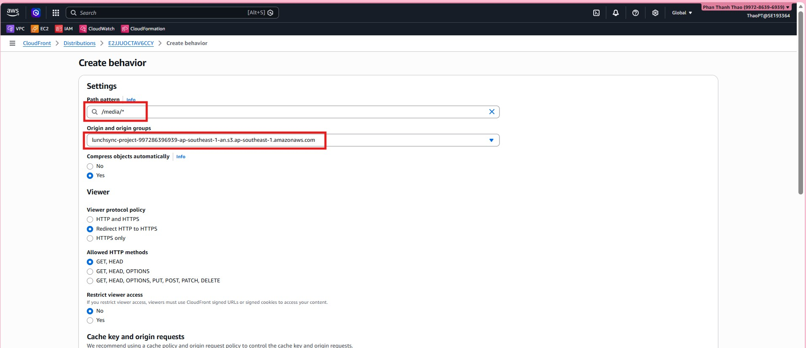

6. Rà soát các thiết lập nâng cao trước khi gửi tạo distribution.

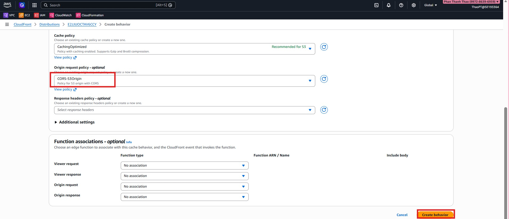

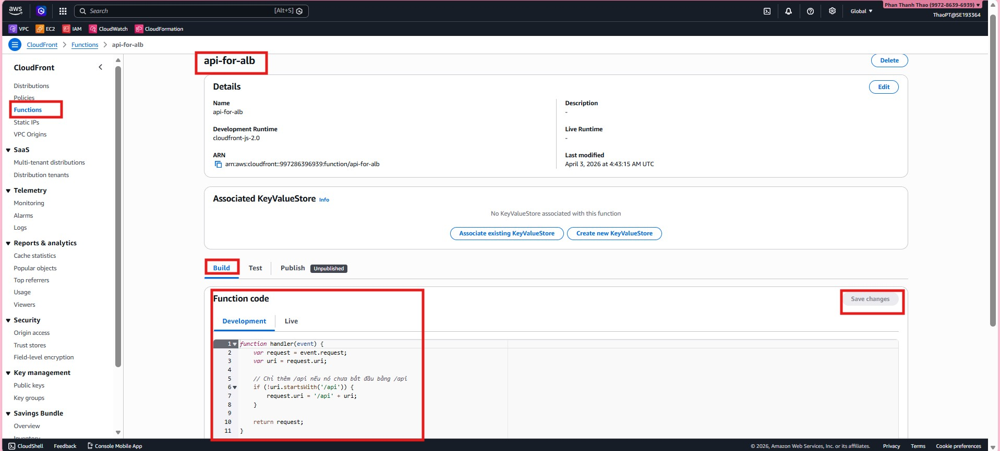

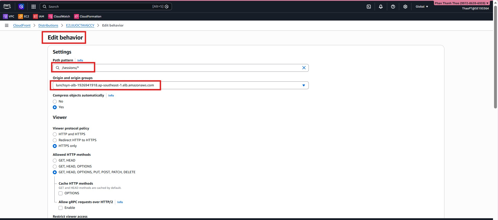

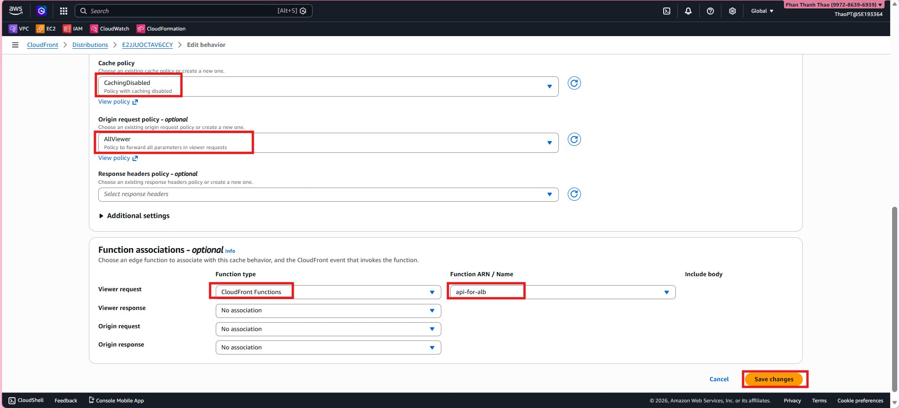

7. Tạo distribution và chờ trạng thái deploy được cập nhật.

8. Kiểm tra domain name của distribution, thử truy cập nội dung và xem lại kết quả cuối cùng.

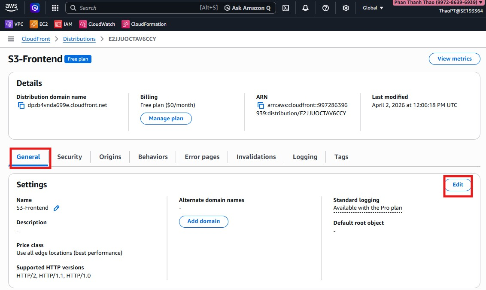

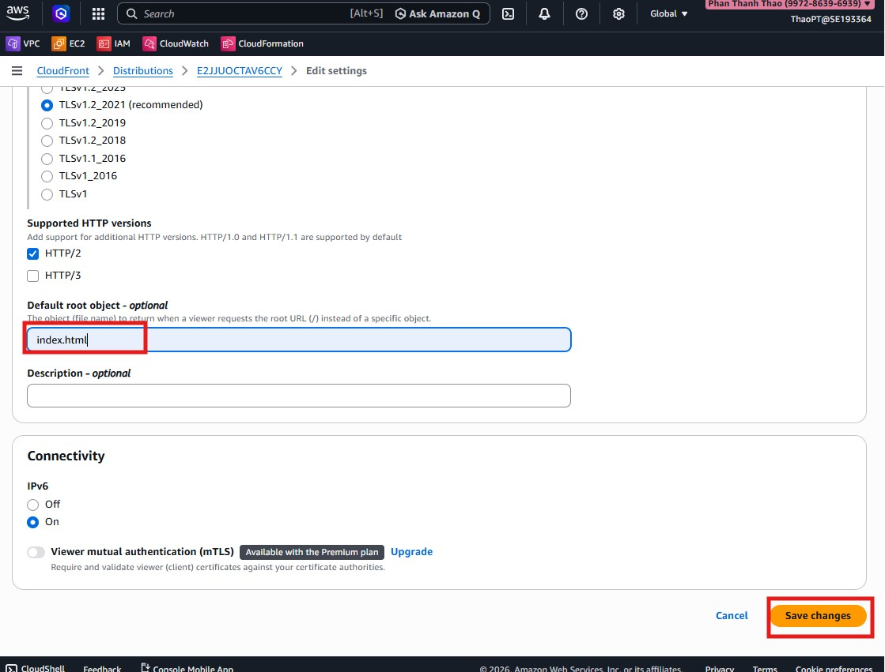

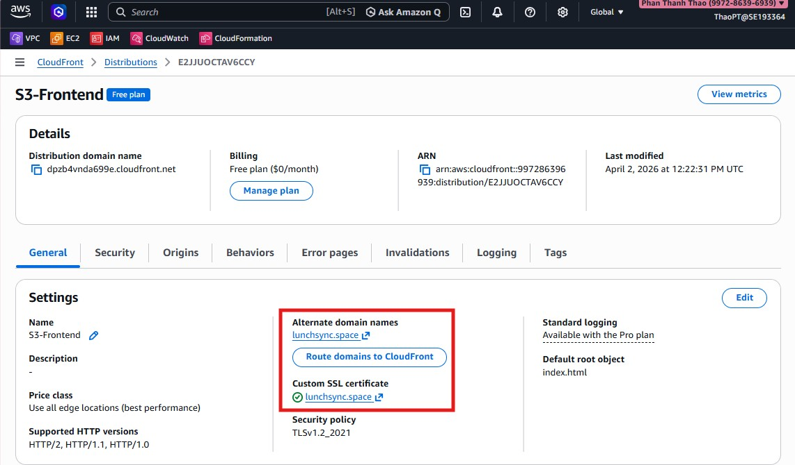

