#### Overview

This section presents the **Route 53**, **ACM**, and **Cognito** configuration steps for the LunchSync access and authentication layer.

#### Implementation steps

1. Open **Amazon Route 53**, go to **Hosted zones**, and start creating a new hosted zone for the workshop domain.

2. In **Create hosted zone**, enter `lunchsync.space`, choose **Public hosted zone**, and create the zone.

3. After the zone is created, review the default **NS** and **SOA** records for `lunchsync.space`.

4. Copy the 4 nameservers from the **NS** record and update them at your domain registrar so Route 53 becomes the DNS authority for `lunchsync.space`.

5. Move to **AWS Certificate Manager (ACM)** in the region used by the backend and start a public certificate request.

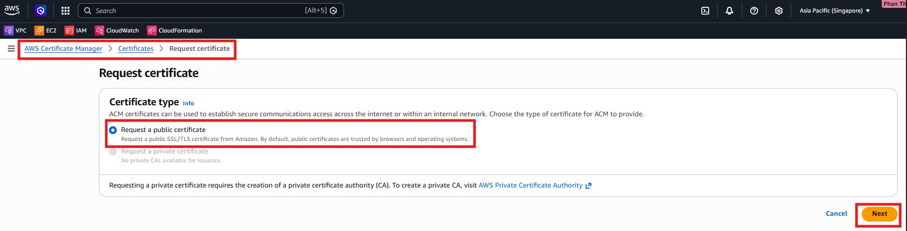

6. Choose **Request a public certificate**, enter `lunchsync.space` and `*.lunchsync.space`, and use **DNS validation**.

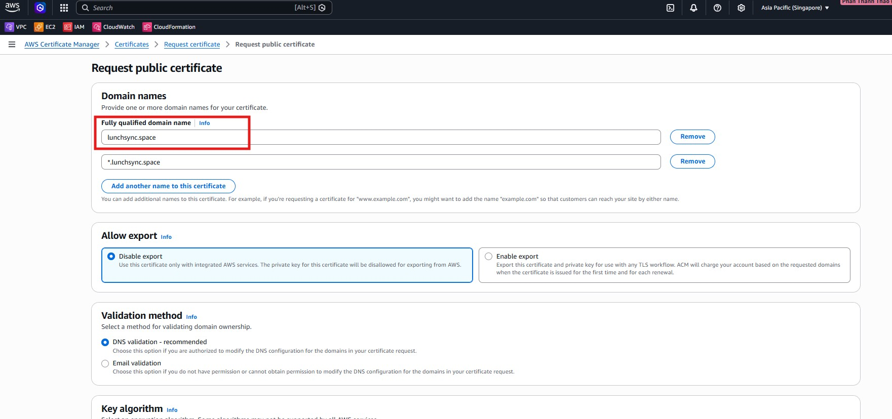

7. Keep the default key algorithm such as `RSA 2048`, review the request, and submit the certificate request.

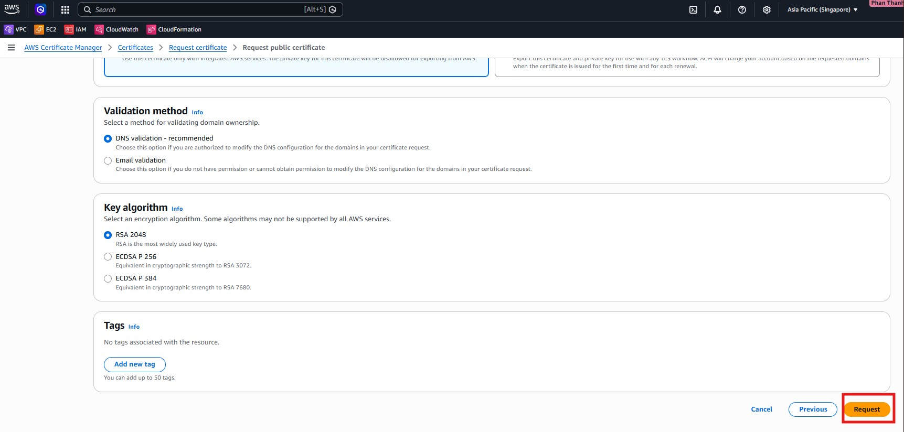

8. Open the new certificate details page and inspect the **CNAME** records used for DNS validation in Route 53.

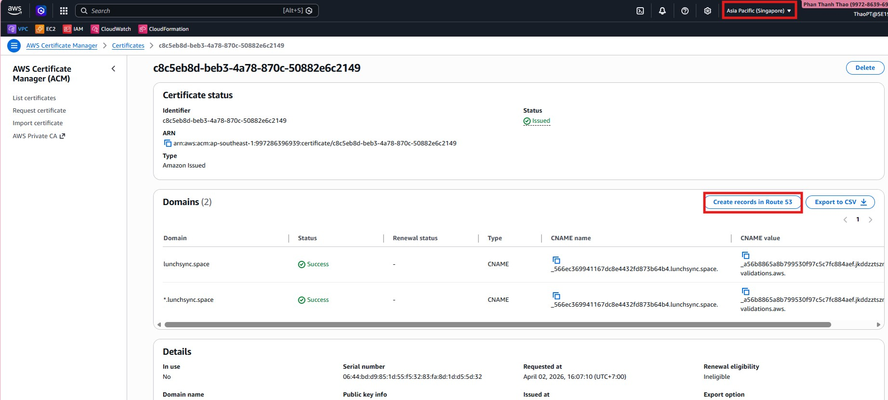

9. If ACM shows **Create records in Route 53**, use it to create the missing validation records directly from ACM.

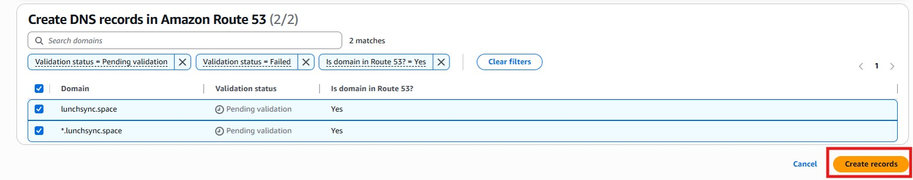

10. Wait until the certificate in the application region changes to **Issued**, then keep its ARN for the ALB step.

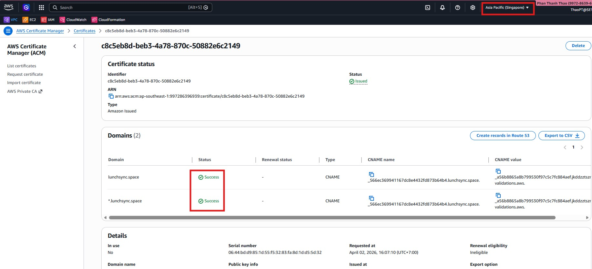

11. Repeat the certificate request flow in **US East (N. Virginia)** so CloudFront has its own certificate, then confirm that this certificate also reaches **Issued**.

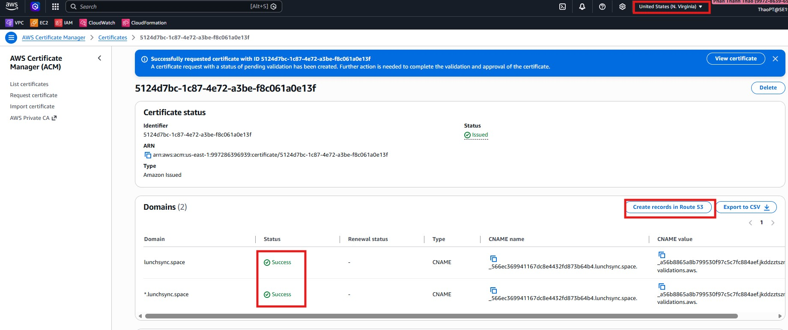

12. Open **Amazon Cognito** and choose **Create user pool** for LunchSync.

13. Choose **Traditional web application**, name the app `Lunchsync-App`, use `Email` and `Username` for sign-in, enable **Self-registration**, and keep the required sign-up attributes such as `email` and `name`.

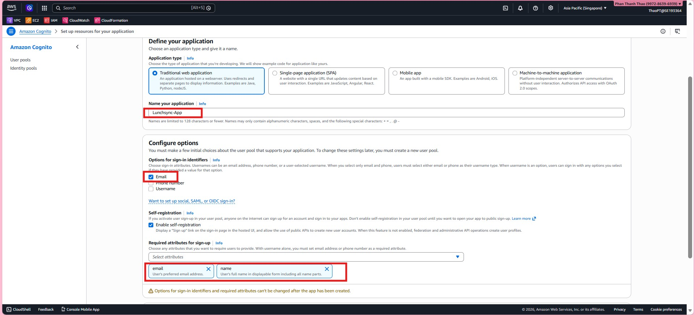

14. Set the **Return URL** to `https://lunchsync.space/`, then finish the quick setup so Cognito creates both the user pool and app client.

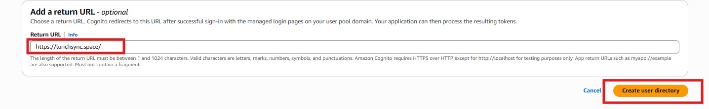

15. Reopen the new pool and confirm that `Lunchsync-App` is attached to `Lunchsync - user pool`.

16. Open **App client** to capture the **Client ID**, inspect the **Client secret**, and review token settings.

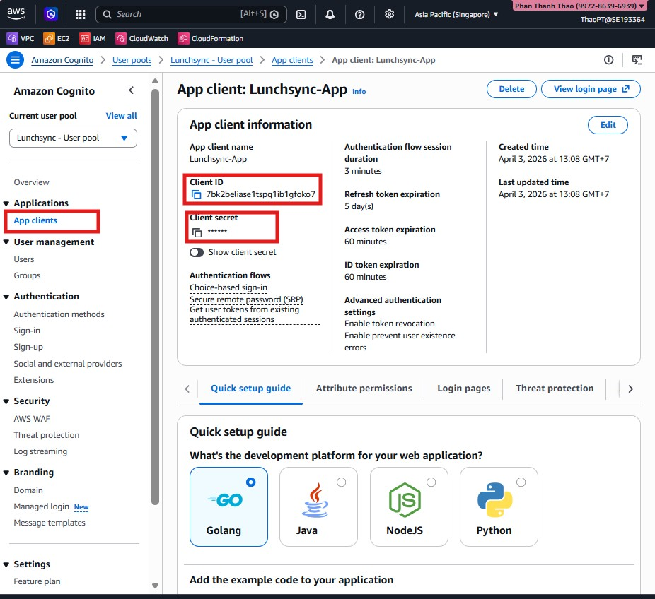

17. Open the **Sign-in** tab of the user pool and review sign-in options, MFA, and device-tracking settings.

18. Edit **App client information** if needed and make sure the client allows the required flows such as `ALLOW_USER_AUTH` and `ALLOW_REFRESH_TOKEN_AUTH`.

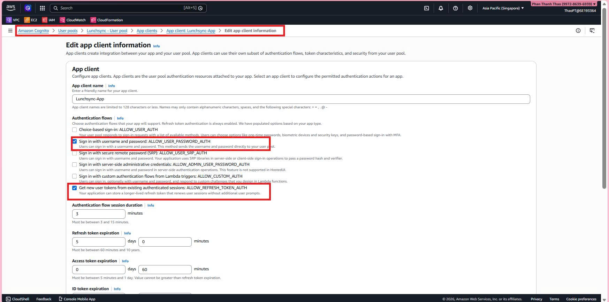

19. Move to **AWS Secrets Manager**, choose **Other type of secret**, and store Cognito values such as `cognito_client_id`, `cognito_user_pool_id`, and `cognito_client_secret`.

20. Name the secret `lunchsync/cognito` so the backend can reference it consistently at runtime.

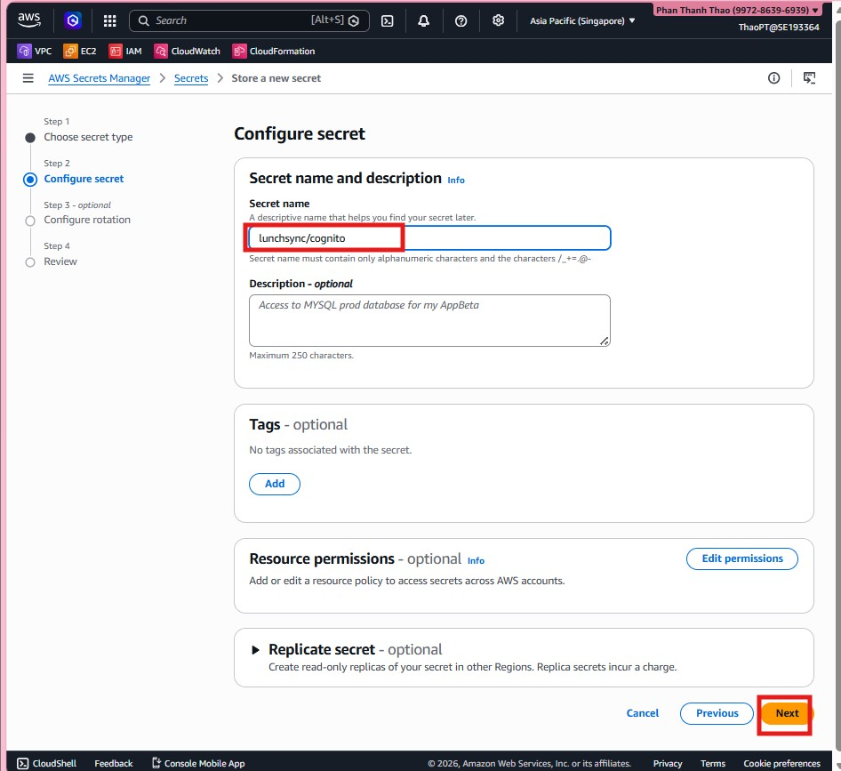

21. Finish creating the secret and confirm that `lunchsync/cognito` appears in the Secrets Manager list together with the other application secrets.

